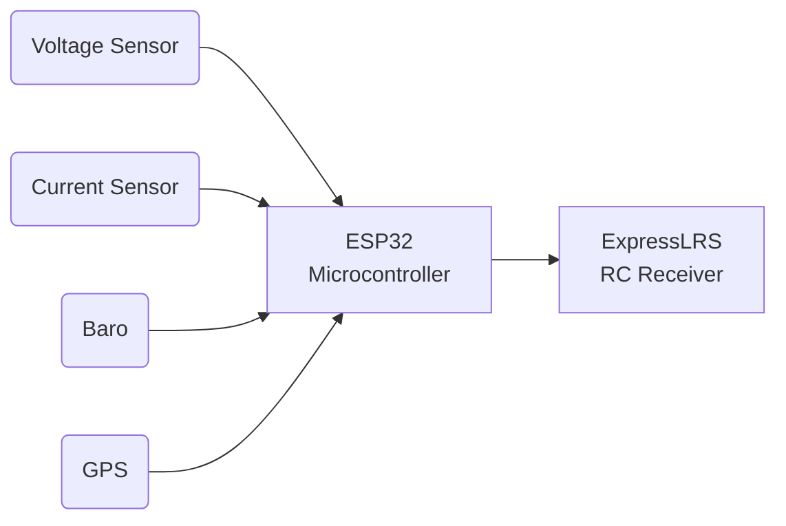

# OpenCRSFSensor
Connecting various Telemetry Sensors, such as Voltage, Current, Baro (Vario) to Crossfire capable RC (Radio Control) Receivers, using an ESP32
Microcontroller.

Currently supported and tested are the following components:

RC Receivers:
- <em>Radiomaster ER8</em> ELRS (Express LRS) Receiver

Microcontrollers:
- WROOM ESP32
- ESP32-C3 SuperMini

## ESP32 Super Mini wiring example

